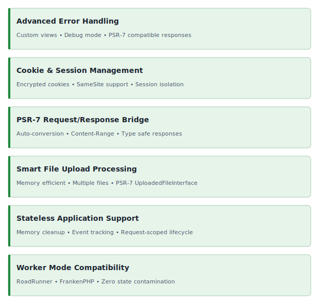

<!-- markdownlint-disable MD041 -->
<p align="center">
    <picture>
        <source media="(prefers-color-scheme: dark)" srcset="https://www.yiiframework.com/image/design/logo/yii3_full_for_dark.svg">
        <source media="(prefers-color-scheme: light)" srcset="https://www.yiiframework.com/image/design/logo/yii3_full_for_light.svg">
        
    </picture>
    <h1 align="center">PSR bridge</h1>
    <br>
</p>
<!-- markdownlint-enable MD041 -->

<p align="center">
    <a href="https://github.com/yii2-extensions/psr-bridge/actions/workflows/build.yml" target="_blank">
        
    </a>
    <a href="https://dashboard.stryker-mutator.io/reports/github.com/yii2-extensions/psr-bridge/main" target="_blank">
        
    </a>
    <a href="https://github.com/yii2-extensions/psr-bridge/actions/workflows/static.yml" target="_blank">
        
    </a>
    <a href="https://github.com/yii2-extensions/psr-bridge/actions/workflows/security.yml" target="_blank">
        
    </a>
</p>

<p align="center">
    <strong>Transform your Yii2 applications into high-performance, PSR-compliant powerhouses</strong><br>
    <em>Supporting traditional SAPI, RoadRunner, FrankenPHP, and worker-based architectures</em>
</p>

## Available deployment options

### High-Performance Worker Mode

Long-running PHP workers for higher throughput and lower latency.

[](https://github.com/yii2-extensions/franken-php)
[](https://github.com/yii2-extensions/road-runner)

## Features

<picture>
    <source media="(min-width: 768px)" srcset="./docs/svgs/features.svg">
    
</picture>

### Installation

```bash
composer require yii2-extensions/psr-bridge:^0.3
```

### Quick start

#### Worker mode (FrankenPHP)

```php
<?php

declare(strict_types=1);

// disable PHP automatic session cookie handling
ini_set('session.use_cookies', '0');

require_once dirname(__DIR__) . '/vendor/autoload.php';

use yii2\extensions\frankenphp\FrankenPHP;
use yii2\extensions\psrbridge\http\Application;

// Load environment variables from .env file
$dotenv = Dotenv\Dotenv::createImmutable(dirname(__DIR__));
$dotenv->safeLoad();

// production default (change to 'true' for development)
define('YII_DEBUG', filter_var($_ENV['YII_DEBUG'] ?? false, FILTER_VALIDATE_BOOLEAN));
// production default (change to 'dev' for development)
define('YII_ENV', $_ENV['YII_ENV'] ?? 'prod');

require_once dirname(__DIR__) . '/vendor/yiisoft/yii2/Yii.php';

$config = require_once dirname(__DIR__) . '/config/web/app.php';

$app = new Application($config);
$runner = new FrankenPHP($app);

$runner->run();
```

#### Worker mode (RoadRunner)

```php
<?php

declare(strict_types=1);

require __DIR__ . '/../vendor/autoload.php';

use yii2\extensions\psrbridge\http\Application;
use yii2\extensions\roadrunner\RoadRunner;

define('YII_DEBUG', filter_var(getenv('YII_DEBUG'), FILTER_VALIDATE_BOOLEAN));
define('YII_ENV', getenv('YII_ENV') ?? 'prod');

require __DIR__ . '/../vendor/yiisoft/yii2/Yii.php';

$config = require dirname(__DIR__) . '/config/web/app.php';

$app = new Application($config);
$runner = new RoadRunner($app);

$runner->run();
```

#### PSR-7 Conversion

```php
// Convert Yii2 request to PSR-7
$request = Yii::$app->request;
$psr7Request = $request->getPsr7Request();

// Convert Yii2 response to PSR-7
$response = Yii::$app->response;
$psr7Response = $response->getPsr7Response();

// Emit PSR-7 response
$emitter = new yii2\extensions\psrbridge\emitter\SapiEmitter();
$emitter->emit($psr7Response);
```

> [!NOTE]
> This shows the low-level conversion API. Serving a full request in a long-running worker goes through the
> `handle() → emit → finalize()` cycle (or a runner). See
> [Response lifecycle finalization](docs/examples.md#response-lifecycle-finalization).

### Worker lifecycle defaults

In long-running workers, keep `Application` lifecycle defaults unless you have a specific requirement:

- `useSession=true`
- `syncCookieValidation=true`
- `resetUploadedFiles=true`

> [!WARNING]
> Keep request-scoped components (`request`, `response`, `errorHandler`, `session`, `user`) out of
> `Application::$persistentComponents`.
>
> Components listed in `Application::$persistentComponents` (defaults to `db` and `cache`) keep loaded instances across
> requests.

Define lifecycle flags before `run()` (via config or property setters).

```php
$config = [
    'class' => Application::class,
    // disable session and cookie validation sync for stateless REST APIs.
    // keep resetUploadedFiles=true (default) for request isolation.
    'useSession' => false,
    'syncCookieValidation' => false,
    'resetUploadedFiles' => true,
];
```

### Smart Body Parsing

The bridge automatically parses incoming PSR-7 request bodies based on the `Content-Type` header and your configured
parsers (for example, `application/json`), ensuring `Yii::$app->request->post()` works seamlessly in worker mode without
extra boilerplate.

## Documentation

For detailed configuration options and advanced usage.

- 📚 [Installation Guide](docs/installation.md)
- ⚙️ [Configuration Reference](docs/configuration.md)
- 💡 [Usage Examples](docs/examples.md)
- 🧪 [Testing Guide](docs/testing.md)

## Package information

[](https://www.php.net/releases/8.1/en.php)
[](https://packagist.org/packages/yiisoft/yii2)
[](https://github.com/yiisoft/yii2/tree/22.0)
[](https://packagist.org/packages/yii2-extensions/psr-bridge)
[](https://packagist.org/packages/yii2-extensions/psr-bridge)

## Project status

[](https://codecov.io/github/yii2-extensions/psr-bridge)
[](https://github.com/yii2-extensions/psr-bridge/actions/workflows/static.yml)
[](https://github.com/yii2-extensions/psr-bridge/actions/workflows/quality.yml)
[](https://github.styleci.io/repos/1019044094?branch=main)

## Our social networks

[](https://x.com/Terabytesoftw)
[](https://www.facebook.com/wilmer.arambula.9)
[](https://www.reddit.com/r/Yii2/)
[](https://t.me/yii_framework_in_english)

## License

[](LICENSE)
